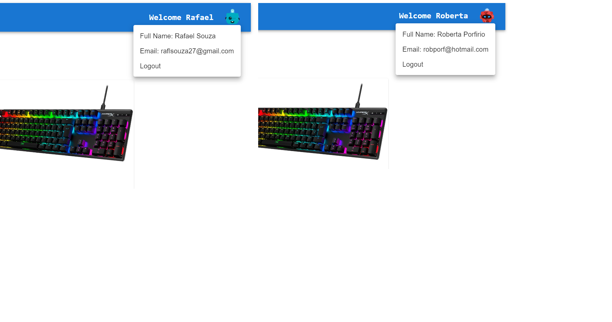
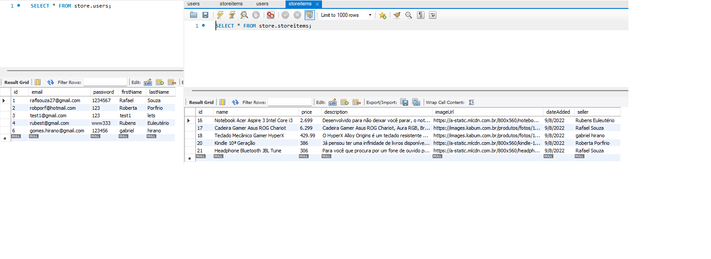
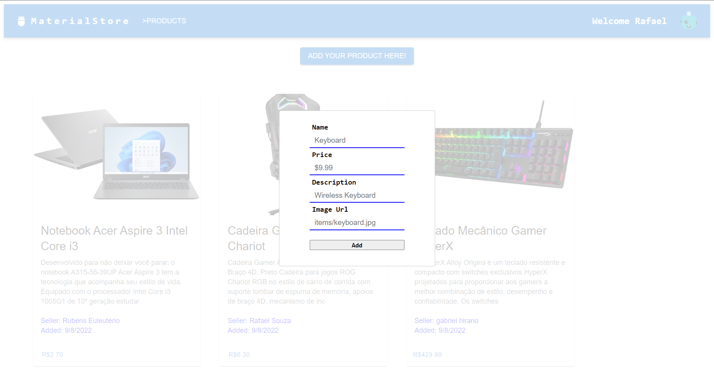
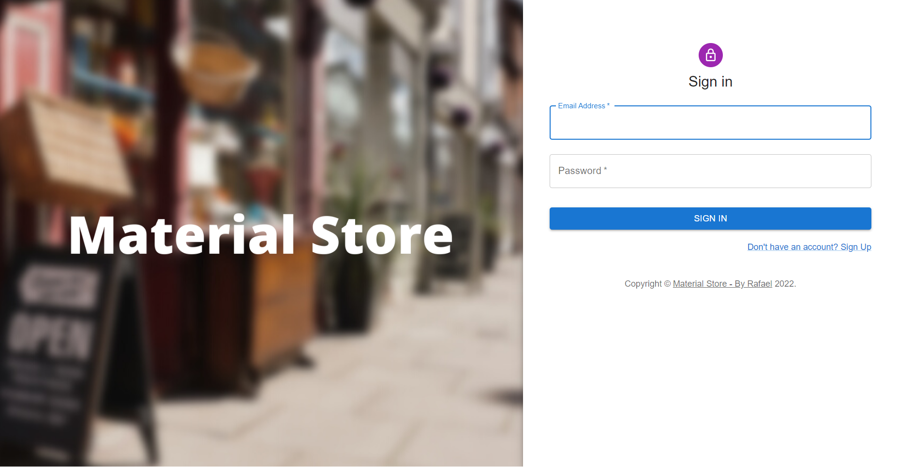
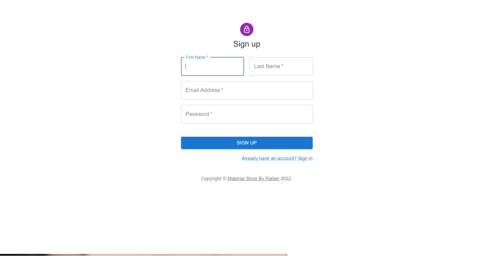

# 🔷🔷💸💸materialStore💸💸🔷🔷

•A simple store where you can create your account/login and browse products added by other users and also add your own.

In this project I bring together everything I learned with my previous projets, such as:  
•Relational SQL DB where I store user info for login / Product info  
•For the UI I started using Material UI instead of bootstrap for testing, and it turned out pretty good.  

•React Routes / Axios / Express / Node / React-Modal / Flex  

Main Page

Different Logged in Users

DataBase

Adding new Products Modal

Login Page

Sign Up Page

